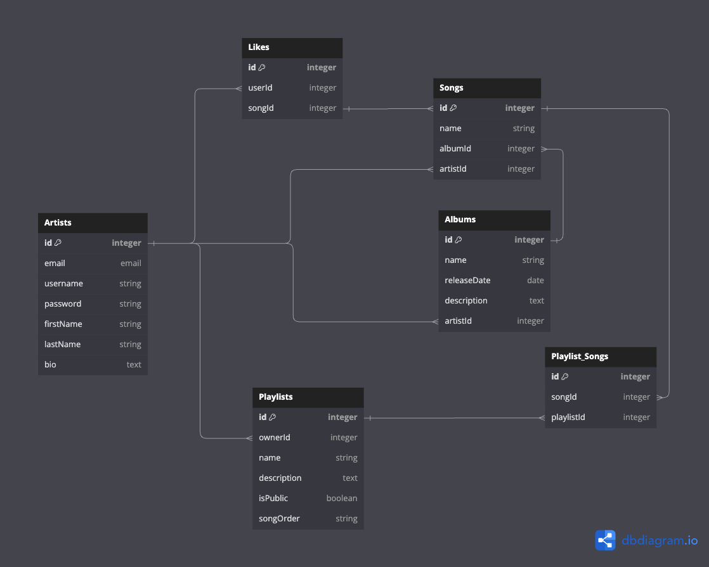

# DB Schema

## Artists
| Column name | data type | details |
|--- | --- | --- |
| id | integer | PK |
| email | email | not null, unique |
| userName | string | not null, unique |
| password | string | not null |
| firstName | string | not null |
|lastName | string | not null |
| bio | text | not null |

## Playlists
| Column name | data type | details |
|--- | --- | --- |
| id | integer | PK |
| ownerId | integer | . | 
| name | string | . |
| description | text | . |
| isPublic | boolean | . |

## Albums
| Column name | data type | details |
|--- | --- | --- |
| id | integer | PK |
| name | string |  |
| releaseDate | date |  |
| description | text |  | 
| artistId | integer | . |

## Songs
| Column name | data type | details |
|--- | --- | --- |
| id | integer | PK |
| name | string | . | 
| albumId | integer| . |
| artistId | integer| . |

## Playlists_Songs 
| Column name | data type | details |
|--- | --- | --- |
| id | integer | PK |
| songId | integer | . |
| playlistId | integer| . |
| songOrder | integer| . |

## Likes
| Column name | data type | details |
|--- | --- | --- |
| id | integer | PK |
| userId | integer | . |
| songId | integer | . |

